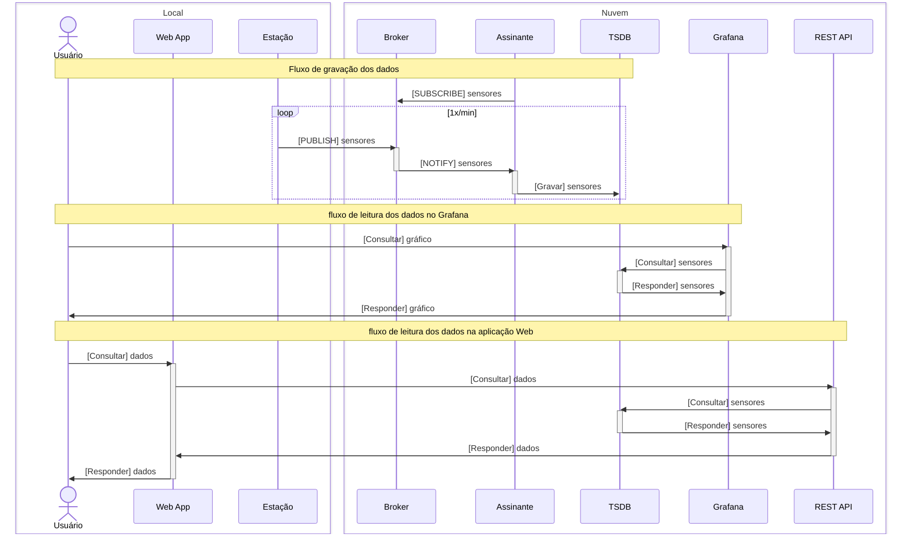

# Estações Meteorológicas

Para as estações meteorológicas, o fluxo é  o seguinte:



- [#45](https://github.com/feira-de-jogos/feira-de-jogos/issues/45): o formato das mensagens das estações para o *broker* é baseado no [*line protocol* do InfluxDB, versão 2](https://docs.influxdata.com/influxdb/v2/reference/syntax/line-protocol/):

- Tópico: `em/<uuid>`, onde `<uuid>` é o identificador da estação;
- Mensagem: `em/<uuid>,v=<versão>,lat=<lat>,lng=<longitude>,alt=<altitude> <chave1>=<valor1>,<chave1>=<valor1>,...,<chaveN>=<valorN> <ns_timestamp>`, onde:
  - `<uuid>`: identificador da estação;
  - `<versão>`: versão da estação em inteiros (0, 1 etc.);
  - `<lat>`: latitude da estação;
  - `<lng>`: longitude da estação;
  - `<alt>`: altitude da estação;
  - `<chave>`: nome do atributo a ser armazenado;
  - `<valor>`: valor do atributo a ser armazenado;
  - `<ns_timestamp>`: UNIX timestamp em nanossegundos.
  
  Exemplo:
  
  ```text
  Tópico: em/8364DE0C-2534-431A-B6A2-965569C3EE52
  Mensagem: 8364DE0C-2534-431A-B6A2-965569C3EE52,v=1,lat=-27.608574,lng=-48.633181,alt=57 temperatura=17,umidade=76.4 1751665693000000000
  ```

