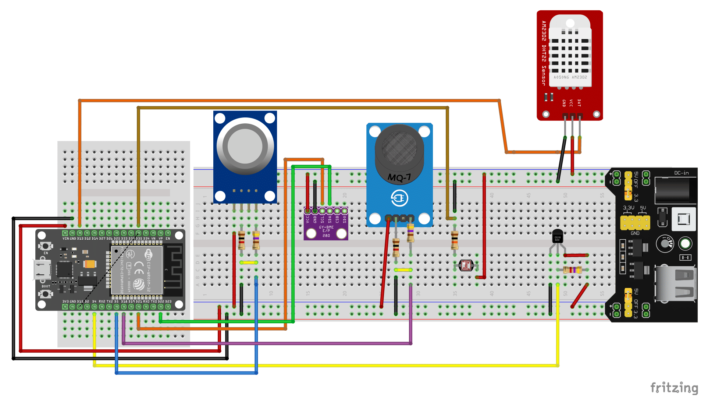

# Versão 0

Esta primeira versão contém apenas os sensores básicos e conexão direta à Internet via Wi-Fi.

## Andamento da versão:

Sensores instalados:

1. **Sensor DHT11:** O sensor está conectado na GPIO 23 da ESP32 e fornece leituras de temperatura e umidade. O módulo utilizado é integrado à linguagem.
1. **Sensor BMP280:** O sensor usa o protocolo serial I2C para comunicação com a ESP32, está conectado nas GPIOs 22 (SCL) e 21 (SDA). Ele opera medindo temperatura e pressão. O módulo utilizado pode ser encontrado [aqui](https://github.com/PaszaVonPomiot/micropython-driver-bmp280).
1. **Sensor MQ7:** Este sensor oferece 2 tipos de conexão: digital e análogica, como o projeto pretende obter valores, ele está conectado na GPIO 36 (Somente leitura, com ADC presente). Ele fornece a concentração de Monoxido de Carbono presente no ar em PPM (partículas por milhão). O módulo utilizado pode ser encontrado [aqui](https://github.com/kartun83/micropython-MQ/tree/master).
1. **RTC DS3231:** Este módulo também utiliza I2C para comunicação com a ESP32, está conectado nas GPIOs 5 (SCL) e 4 (SDA). Ele opera como um relógio em tempo real, marcando o tempo mesmo se a ESP32 fique sem energia usando uma bateria CR2032. O módulo utilizado pode ser encontrado [aqui](https://github.com/pangopi/micropython-DS3231-AT24C32).
1. **Sensor DS18B20:** Este sensor utiliza o protocolo OneWire para comunicação com a ESP32, enviando os dados coletador de forma digital. Ele está conectado na GPIO 2 da ESP32. Ele é capaz de medir temperaturas entre -55°C e 125°C com precisão informada de 0,5°C. O módulo utilizado é integrado à linguagem MicroPython.
1. **Sensor MQ4:** Este sensor foi instalado usando a porta análogica, ele está conectado na GPIO 39 (Somente leitura, com ADC presente). Ele fornece a concentração de Gás Metano presente no ar em PPM (partículas por milhão). O módulo utilizado pode ser encontrado [aqui](https://github.com/kartun83/micropython-MQ/tree/master)
1. **Sensor de pingos de chuva:** Foi instalado na GPIO 34 (Somente leitura, com ADC presente) usando a conexão analógica.
1. **Módulo GPS NEO-6M:** Foi instalado nas GPIOs 12 e 13, utilizando interface serial para envio dos dados de GPS. O hardware pode apresentar algumas distorções nos dados caso não esteja nas condições ideais (Ambiente aberto, céu limpo, baixa interferência).

Observações:

- A leitura do RTC é transformada em formato [*timestamp* UNIX](https://datatracker.ietf.org/doc/html/rfc3339).
- As leituras destes sensores são obtidas em 60~120 segundos.

### Modelo de dados

O modelo segue o padrão [Line protocol](https://docs.influxdata.com/influxdb/v2/reference/syntax/line-protocol/) da Influxdata.

As etiquetas, ou marcações, atuam como atributos do registro:

| Ordem | *Tag* | Descrição |
|-|-|-|
| 1º | `v` | Versão da estação meteorológica |
| 2º | `lat` | Latitude da estação meteorológica |
| 3º | `lng` | Longitude da estação meteorológica |
| 4º | `alt` | Altitude da estação meteorológica |

As variáveis são os valores a serem armazenados em séries tempoarais:

| Ordem | Variável| Unidade| Descrição|
|-|-|-|-|
| 1º| `dht11_temp`| °C| Temperatura ambiente medida pelo sensor DHT11|
| 2º| `dht11_umid`| %| Umidade relativa do ar medida pelo sensor DHT11|
| 3º| `bmp280_temp`| °C| Temperatura ambiente medida pelo sensor BMP280|
| 4º| `bmp280_press`| hPa| Pressão atmosférica medida pelo sensor BMP280|
| 5º| `ds18b20_temp`| °C| Temperatura medida pelo sensor DS18B20|
| 6º| `mq7_co`| ppm| Concentração de monóxido de carbono (CO) detectada  |
| 7º| `mq4_ch4`| ppm| Concentração de metano, Gás Natural ou GLP detectada   |
| 8º| `sensor_chuva`| sem unidade |Detecção de água no sensor de chuva|
|X|`timestamp`|ns|Timestamp UNIX em ns medindo o tempo no momento da leitura|

Observações:

- Os dados são enviados via MQTT para o *broker* da feira de jogos.
- A versão `0` já está operacional.
- O GPS instalado fornece dados de altitude, longitude e latitude **que não são totalmente confiáveis**.
- Os dados de GPS só são atualizados caso haja mudança de mais de 500m, e são armazenados em arquivo JSON.
- Os dados sensíveis marcados no código com `dotenv.` são armazenados no arquivo `config.env`.
- Para identificação das mensagens enviadas e das estações ativas será usado o sistema de `UUIDs`:
  - `fa875d3f-d1ef-4c27-b774-b41c69d70608` - **1ª estação V0**.

--- 
 # Dados provenientes do prof. Clayrton 

 ## Possíveis sensores:

Temperatura:

- Analógicos: LM35 (LM335 / LM34), DHT11/DHT22, TMP36
- Digitais: DS18B20, BME280, Termopares

Pressão atmosférica:

- BMP180
- BMP280
- BME280

Umidade relativa:

- BME280
- DHT11 / DHT22

Contaminação do ar:

- MQ-2 (inflamáveis): GLP, metano, propano, butano, hidrogênio.
- MQ-3: álcool e etanol.
- MQ-4: metano, propano e butano.
- MQ-5 (5VDC): alta sensibilidade para gases GLP e GN, baixa sensibilidade para álcool e fumaça.
- MQ-6: alta sensibilidade para GLP, isobutano e propano, baixa sensibilidade para álcool e fumaça, de 300 a 10000ppm.
- MQ-7: monóxido de carbono, de 10 a 1000ppm.
- MQ-8: alta sensibilidade para hidrogênio (H2), baixa sensibilidade para gás de cozinha, álcool e fumaça, de 100 a 10000ppm.
- MQ-9: monóxido de carbono, metano e propano, 100 a 10000.
- MQ-135 (5VDC): gases tóxicos como amônia, dióxido de carbono, benzeno, óxido nítrico, fumaça e álcool, 10 a 1000ppm.

Fonte: [Casa da Robótica](https://www.casadarobotica.com/sensores-modulos/sensores/gas/kit-sensor-de-gas-mq-2-mq-3-mq-4-mq-5-mq-6-mq-7-mq-8-mq-9-mq-135).

Radiação Solar:

- LDR para iluminação solar.

Latitude, longitude e altitude:

- Módulo GPS NEO-6M com Antena.

Fonte: [Eletrogate](https://www.eletrogate.com/modulo-gps-neo-6m-com-antena).

*Real Time Clock* (RTC):

- RTC DS3231.

Fonte: [Eletrogate](https://www.eletrogate.com/real-time-clock-rtc-ds3231).

*Interessante por contar com um sensor de temperatura interno e um oscilador para melhorar a exatidão da medida. Capaz de fornecer formato 12h e 24h e apresentar segundos, minutos, horas dia via protocolo I2C.*

### Sensibilidade

| Variável | Tipo | Faixa | Unidade |
|-|-|-|-|
| MQ2G | inteiro | 300 a 10.000 | ppm |
| MQ3G | inteiro | 10 a 10.000 | ppm |
| MQ4G | inteiro | 300 a 10.000 | ppm |
| MQ5G | inteiro | 200 a 10.000 | ppm |
| MQ7G | inteiro | 10 a 1.000   | ppm |
| MQ8G | inteiro | 100 a 10.000 | ppm |
| MQ135 | inteiro | 10 a 1.000   | ppm |

### Dados sobre a  V0 antiga:

Esquemático

- Realizar a montagem com os materiais existentes e avaliar a compra de pelo menos dois kits distintos, a fim de avaliar a timetag, protocolo de sincronismo e integridade dos dados.

| Código | Sensores                  | Tensão de Operação | Tensão de Entrada | Corrente de Operação | Pino ESP32 | Protocolo de Comunicação | Variável                         |
|--------|---------------------------|---------------------|--------------------|------------------------|-------------|----------------------------|----------------------------------|
| 1      | DS18B20                   | 3.0 - 5.5V          | 3.3V ou 5V         | ~1.5mA                | GPIO4       | OneWire pin D04           | Temperatura                      |
| 2      | BMP280                    | 1.71 - 3.6V         | 3.3V               | ~0.006mA              | GPIO21 e 22 | I2C - pin D21             | Pressão Atmosférica              |
| 3      | MQ-2                      | 5V                  | 5V                 | ~150mA                | GPIO5       | Analógico                  | Gás Inflamável                   |
| 4      | MQ-2                      | 5V                  | 5V                 | ~150mA                | GPIO5       | Analógico                  | Fumaça                           |
| 5      | MQ-7: Monóxido de Carbono | 3 - 5V              | 5V                 | ~150mA                | GPIO18      | Analógico                  | Monóxido de Carbono (CO)         |
| 6      | DHT-22                    | 3.3 - 5V            | 3.3V ou 5V         | ~1-2.5mA              | GPIO13      | Digital pin D13           | Umidade                          |
| 7      | LDR                       | Variável            | 3.3V ou 5V         | Depende do circuito   | GPIO35      | Analógico                  | Luminosidade                     |

---

| Código dos Sensores | Parâmetro Associado          | Unidade de Medida     |
|---------------------|------------------------------|------------------------|
| 1                   | Temperatura                  | °C                     |
| 2                   | Pressão Atmosférica          | hPa                    |
| 3                   | Gás Inflamável               | Concentração (ppm)     |
| 4                   | Fumaça                       | Concentração (ppm)     |
| 5                   | Monóxido de Carbono (CO)     | Concentração (ppm)     |
| 6                   | Umidade                      | %                      |
| 7                   | Luminosidade                 | %                      |

---

### Grandezas solicitadas

Conforme reunião realizada em 12/02/2025 as principais grandezas a serem monitoradas consistem em:

| Grandeza| Professor|
|-|-|
| Temperatura ambiente (ºC)| Humberto|
|Pressão Atmosférica (hPa)| Humberto|
|Umidade relativa do ar (%)| Humberto |
| Latitude, longitude e altitude (º, º, m)| Humberto|
|Direção e velocidade do vento (º e m/s)|Humberto|
|Radiância Solar (W/m²)| Humberto|
|Contaminação do ar ("fumaça", CH4, CO, CO2) (ppm)| Humberto|
|Qualidade do ar (N2, O2)* (ppm)|Humberto|
|Tempo real (segundos)|Clayrton|
|Intensidade de chuva (mm)|Paulo|

