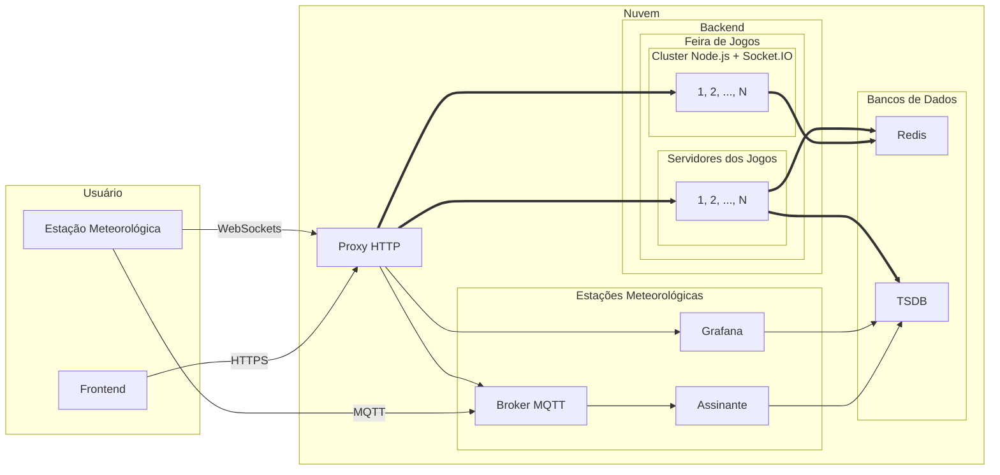

# Versão 3

## Requisitos funcionais e não funcionais

Requisitos funcionais:

1. Suporte a IPv4 e IPv6.
1. Suporte a TCP e UDP para transferência de arquivos.
1. Suporte a UDP, SCTP e SCTP sobre UDP para mídias em tempo real.
1. Suporte a HTTP nas versão 1.0, 1.1, 2.0 e 3.0.
1. Suporte a WebSocket sobre HTTP/1.1.
1. Balanceamento de carga em serviços Web e WebSocket.
1. Autenticação e autorização com OAuth 2.0 no Google e posterior sessão via *cookie* para permitir autorização entre URLs distintas.
1. Suporte obrigatório às seguintes APIs Web: Device orientation, Fullscreen, Gamepad, Geolocation, Service worker, Storage, Touch, WebGL, WebRTC, WebSocket.
1. Suporte desejável às APIs Web: Battery, Web Bluetooth, Console, Fetch,  Notification, Performance, Push, Vibration, WebTransport, WebXR.
1. Persistência dos dados de usuários em bancos de dados centralizado.
1. Uso de *Selective Forwarding Unit* (SFU) para mídias em tempo real entre os jogadores.

Requisitos não funcionais:

1. Suporte a pelo menos 1000 conexões WebSocket simultâneas.
1. Testes regulares de carga em servidores e de monitoramento dos serviços Web.
1. Possibilidade de migração futura de WebSocket sobre HTTP/1.1 para WebTransport sobre HTTP/3.
1. Possibilidade de migração futura de SRTP sobre HTTP/1.1 e HTTP/2.0 para Media over QUIC (MoQ) sobre HTTP/3.

## Escolhas tecnológicas

- [#1](https://github.com/feira-de-jogos/feira-de-jogos/issues/1) e [#3](https://github.com/feira-de-jogos/feira-de-jogos/issues/3): [Phaser 4 (rc4)](https://phaser.io/news/2025/05/phaser-mega-update)  com [TypeScript](https://www.typescriptlang.org/).
- [#2](https://github.com/feira-de-jogos/feira-de-jogos/issues/2): [Parcel](https://parceljs.org/).
- [#5](https://github.com/feira-de-jogos/feira-de-jogos/issues/5): [Docker Compose](https://docs.docker.com/compose/) com [réplicas](https://docs.docker.com/reference/compose-file/deploy/#replicas) e [monitoramento de contêiner](https://docs.docker.com/reference/compose-file/services/#healthcheck).
- [#8](https://github.com/feira-de-jogos/feira-de-jogos/issues/8): [Node.js](https://nodejs.org/).
- [#10](https://github.com/feira-de-jogos/feira-de-jogos/issues/10): cluster [Node.js](https://nodejs.org/) e [Redis Streams](https://redis.io/) via [Redis Streams](https://socket.io/docs/v4/redis-streams-adapter/).
- [#11](https://github.com/feira-de-jogos/feira-de-jogos/issues/11): Sinalização de mídia com [Livekit](https://livekit.io/) e lógica de jogo com [Socket.IO](https://socket.io/).
- [#12](https://github.com/feira-de-jogos/feira-de-jogos/issues/12): (*Selective Forwarding Unit*) SFU com [Livekit](https://livekit.io/).
- [#13](https://github.com/feira-de-jogos/feira-de-jogos/issues/13): *Single Sign-On* (SSO) via OAuth 2.0  no Google e posterior sessão com o uso de *cookies*.

## Integração entre serviços

De acordo com [#5](https://github.com/feira-de-jogos/feira-de-jogos/issues/5), [#6](https://github.com/feira-de-jogos/feira-de-jogos/issues/6) e [#7](https://github.com/feira-de-jogos/feira-de-jogos/issues/7), os serviços estão assim interligados:



Em termos de mensagens, um exemplo é o de entrada em um jogo com sessão válida a partir do *backend* da feira de jogos:


```mermaid
sequenceDiagram
  actor Usuário
  participant Frontend
  participant Backend da Feira
  participant Backend do Jogo
  participant Redis
  participant Google

  Usuário -->> Frontend: Clica em "Login com Google"

  Frontend ->> Google: Redireciona para Google OAuth
  activate Google

  Google ->> Usuário: Apresenta tela de consentimento
  activate Usuário

  Usuário ->> Google: Aprova solicitação
  deactivate Usuário

  Google ->> Frontend: Retorna JWT
  deactivate Google

  Frontend ->> Backend da Feira: Envia JWT
  activate Backend da Feira
  
  Backend da Feira ->> Backend da Feira: valida JWT e cria cookie+sessão

  Backend da Feira ->> Redis: Grava sessão

  Backend da Feira ->> Frontend: Retorna cookie
  deactivate Backend da Feira

  Usuário -->> Frontend: Escolhe jogo

  Frontend ->> Backend do Jogo: Solicita WebSocket com cookie
  activate Backend do Jogo

  Backend do Jogo ->> Redis: Verifica sessão
  activate Redis

  Redis ->> Backend do Jogo: Sessão válida
  deactivate Redis

  Backend do Jogo ->> Frontend: Retorna WebSocket (101)
  deactivate Backend do Jogo
  ```

## Desenvolvimento dos jogos

Para os jogos a serem desenvolvidos nesta versão, há um [fluxo de tarefas](./projeto.md) recomendado, bem como um [exemplo de ideia inicial](./sobre-o-jogo.md).
