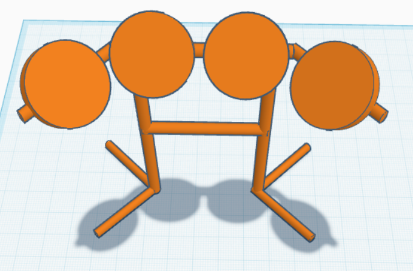

# Registro da construcao do baixo e da bateria

## Entrega 1 (19/09/2025)

1. Primeiramente, vimos as guitarras produzidas anteriormente e alguns modelos feitos com impressora 3D.
2. A partir [desse modelo](https://makerworld.com/pt/models/1179841-b-c-rich-warlock-guitar?from=search#profileId-1189789), fizemos algumas alteracoes para o nosso caso, ja que esse modelo era de uma guitarra real.
3. Chegamos [nesses arquivos](3Dbaixo/) finais.
4. Para chegar nos itens do [inventario](https://docs.google.com/document/d/1b9_pJwN032ziJTy4J76Fd5Iiw4dd0BG0rzivnJ0ZJR4/edit?usp=sharing). Fizemos algumas trocas de ideias com os professores, de como iria funcionar tanto o baixo, como a bateria. Como iriamos reaproveitar uma guitarra que deu errado, nao precisamos ir atras da placa e dos botoes.
5. Esse foi o **desenho inicial do baixo** da primeira entrega:

6. Esse foi o **desenho inicial da bateria** utilizado para fazer o inventario:
