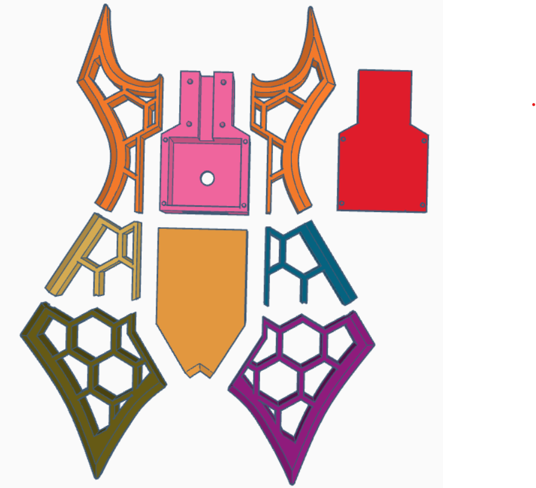
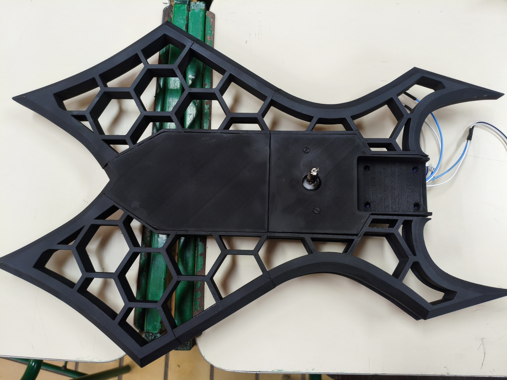
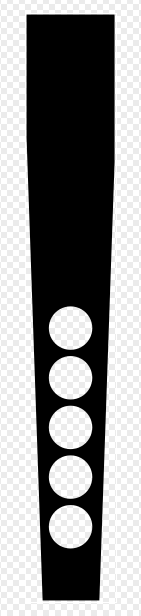
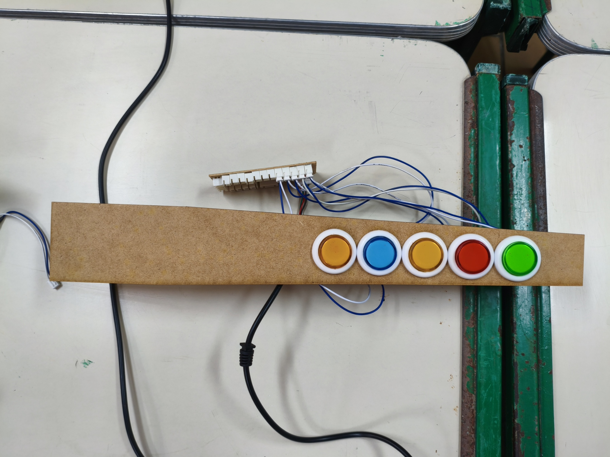
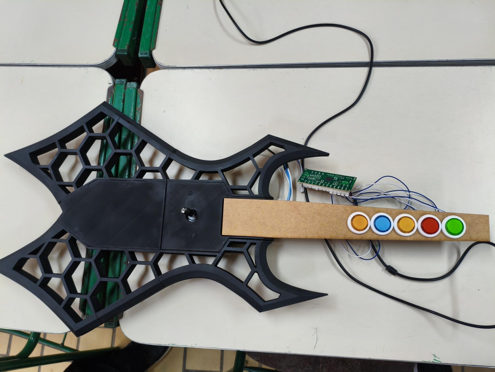
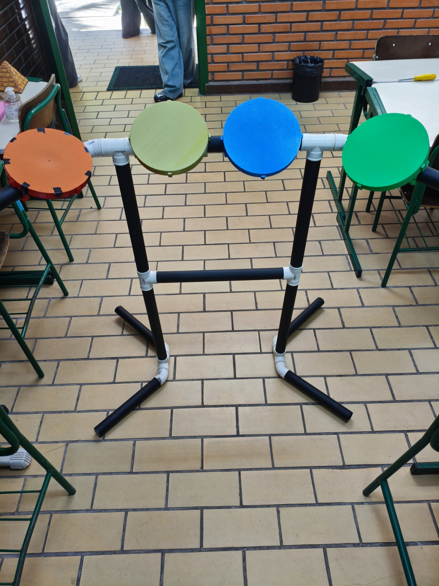

# Registro da construção do baixo e da bateria

## Baixo

1. Primeiramente, vimos as guitarras produzidas anteriormente e alguns modelos feitos com impressora 3D.
2. A partir [desse modelo](https://makerworld.com/pt/models/1179841-b-c-rich-warlock-guitar?from=search#profileId-1189789), fizemos algumas alterações para o nosso caso, já que esse modelo era de uma guitarra real.
3. Chegamos [nesses arquivos](Baixo/) finais.
4. Esse foi o **desenho inicial do baixo** da primeira entrega:

5. Com as peças todas impressas, fizemos a montagem do baixo, colando todas as peças:

6. Fizemos o desenho do braço do baixo e depois colocamos na máquina de corte:

7. Montamos ela parcialmente, mas ainda falta parafusar as partes. Não conseguimos ainda pois precisamos de uma furadeira, que só é disponibilizada para professores.

## Bateria

1. Primeiramente fizemos uma pesquisa para saber as dimensões das baterias feitas para os jogos nesse estilo. Chegamos [nessas medidas](Bateria/medidasCanosBateria.txt) para os canos PVC, sendo necessárias algumas [conexões](Bateria/conexoes.txt).
2. Fizemos alguns modelos de teste para os tambores para testar com o piezoelétrico. Mas durante os testes notou-se que seria mais simples se fizessemos os tambores com reed switchs. Funcionou satisfatoriamente com reed switch, mas para cobrir toda a área do tambor seria necessária uma grande quantidade de sensores, o que tornaria inviável a implementação com eles. Voltamos então para o piezoelétrico.
3. Testando com piezoelétrico, chegamos em um circuito que funcionou com o jogo, mas o delay entre batidas seguidas tinha que ser menor que o alcançado. Precisamos então trocar o circuito com outro circuito/amplificador operacional.
4. Enquanto faziamos os testes, também prosseguimos com a parte da estrutura dela após as chegadas dos itens comprados. Montamos então a estrutura com os canos e as conexões, além de pintar ela e colocar alguns tambores para testar a montagem, chegamos nesse modelo parcial 
5. Terminamos as montagens dos tambores, mas não conseguimos chegar num circuito bom o suficiente. Então fizemos apenas a montagem parcial:
